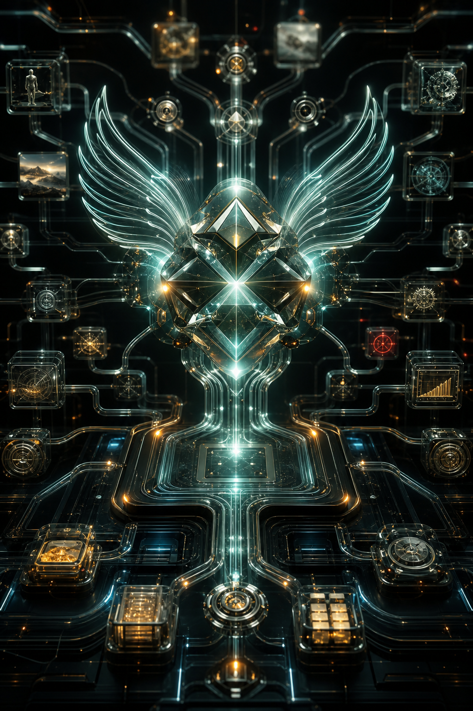
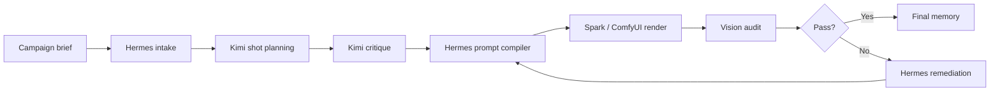

<p align="center">
  
</p>

<h1 align="center">Forge NPS</h1>

<p align="center">
  <strong>A Hermes-led virtual agency for cinematic AI production.</strong>
</p>

<p align="center">
  Hermes orchestrates the pipeline. Kimi Moonshot plans and critiques. Skill packs provide specialist craft. Memory turns every production run into compounding agency intelligence.
</p>

<p align="center">
  <a href="marketing/index.html"><strong>Marketing Site</strong></a>
  ·
  <a href="marketing/app-ui.html"><strong>App UI Concept</strong></a>
  ·
  <a href="INSTALLATION_AGENT_GUIDE.md"><strong>Install Guide</strong></a>
  ·
  <a href="PIPELINE_CONTRACT_SUMMARY.md"><strong>Pipeline Contract</strong></a>
</p>

<p align="center">
  
  
  
  
</p>

---

## The Operating Model

Forge NPS is built around one non-negotiable idea: AI production needs an agency brain, not a pile of disconnected prompts.

| Layer | Role |
| --- | --- |
| **Hermes Agent** | Pipeline brain for campaign intake, skill routing, prompt compilation, continuity, remediation, and memory writes. |
| **Kimi Moonshot** | Director planner and critique model, used for structured shot planning and self-check before render spend. |
| **Skill Pack** | A virtual agency library with 127 skill directories across protocols, Spark operations, style, lighting, diagnostics, continuity, product, character, and script work. |
| **Memory** | Persistent provenance for events, prompts, model choices, audit results, failures, retries, and final outcomes. |
| **Spark / ComfyUI** | Render execution layer for images and videos. |
| **Vision Audit** | Quality gate that drives remediation instead of silent failure. |

## Why It Matters

<table>
  <tr>
    <td width="50%">
      
    </td>
    <td width="50%">
      <h3>Hermes is the agency brain</h3>
      <p>Hermes is not a decorative chat layer. It is the orchestration brain that moves a campaign from brief to plan, prompt, render, audit, retry, and memory.</p>
      <ul>
        <li>Campaign intake and runtime context</li>
        <li>Workflow-specific prompt compilation</li>
        <li>Continuity and remediation routing</li>
        <li>Provenance and memory writes</li>
      </ul>
    </td>
  </tr>
</table>

<table>
  <tr>
    <td width="50%">
      <h3>Memory makes it a true virtual agency</h3>
      <p>Forge records what happened, why it happened, what failed, how it was corrected, and what finally passed. Production history becomes operational intelligence instead of lost context.</p>
      <ul>
        <li>Shot planning events</li>
        <li>Render attempts and results</li>
        <li>Audit scores and issues</li>
        <li>Retry lineage and remediation reasons</li>
      </ul>
    </td>
    <td width="50%">
      
    </td>
  </tr>
</table>

<table>
  <tr>
    <td width="50%">
      
    </td>
    <td width="50%">
      <h3>Kimi Moonshot plans and critiques</h3>
      <p>Kimi is used for director-level planning, not a single shallow prompt. It creates structured shot plans, rationale, constraints, coverage logic, and critique before Hermes executes.</p>
      <ul>
        <li>Structured shot list</li>
        <li>Coverage critique</li>
        <li>Constraint reasoning</li>
        <li>Production handoff to Hermes</li>
      </ul>
    </td>
  </tr>
</table>

## Skill Pack as Virtual Agency

Forge NPS extends Hermes with a curated, multi-layer skills library.

| Specialist Layer | Included Capability |
| --- | --- |
| **14 Forge agent protocols** | Closed-loop Sense, Think, Act, Correct behavior. |
| **13 ComfyUI / Spark operating skills** | Renderer-facing production procedures. |
| **12 deep style specialists** | Cyberpunk, Ghibli, Wes Anderson, Caravaggio, Pixar, Ukiyo-e, Synthwave, Surrealism, Soviet Constructivist, Italian Giallo, Art Nouveau / Deco, Neural Aesthetic. |
| **10 diagnostic skills** | Failure-mode knowledge feeding audit and remediation. |
| **9 cinematography + 10 lighting skills** | Shot language, lensing, lighting, mood, and continuity. |
| **24 profile-specialist skills** | Character, product, and script expertise. |
| **25 bundled Hermes skill directories** | General-purpose upstream Hermes capabilities. |

Every shot record carries a `skills_used` list, so the pipeline tracks which knowledge fired on which render.

Full catalog: [SKILLS_INDEX.md](SKILLS_INDEX.md)

## Canonical Pipeline



## Canonical API Path

1. `POST /api/hermes/run-campaign`
2. `GET /api/shots`
3. `POST /api/audit/reprocess`
4. `POST /api/audit/remediate`
5. `GET /api/memory/health`

Legacy dispatch and render routes are intentionally disabled and return `410 legacy_disabled`; see [PIPELINE_CONTRACT_SUMMARY.md](PIPELINE_CONTRACT_SUMMARY.md).

## Quick Start

```bash
cd /Users/zgbot/Desktop/forge_nps_v01
python3 -m venv .venv
source .venv/bin/activate
python -m pip install -r requirements.txt
python3 -m dashboard.forge_dashboard
```

Open:

```text
http://localhost:7000
```

## Required Services

| Service | Default |
| --- | --- |
| Dashboard | `http://localhost:7000` |
| Kimi / NVIDIA-compatible API | `https://integrate.api.nvidia.com/v1/chat/completions` |
| LM Studio | `http://localhost:1234` |
| ComfyUI / Spark | `http://localhost:8188` |
| Media root | `/Users/zgbot/Desktop/FORGE_NPS_MEDIA` |

Minimum environment/config values:

```bash
KIMI_API_KEY=nvapi-...
NIM_ENDPOINT=https://integrate.api.nvidia.com/v1/chat/completions
KIMI_INSTRUCT_MODEL=moonshotai/kimi-k2-instruct
KIMI_THINKING_MODEL=moonshotai/kimi-k2.6

LMSTUDIO_HOST=http://localhost:1234
LMSTUDIO_PORT=1234
LMSTUDIO_CHAT_MODEL=qwen3.6-35b-a3b@q6_k
LMSTUDIO_VISION_MODEL=qwen3.6-35b-a3b@q6_k

COMFYUI_PRIMARY=http://localhost:8188
FORGE_MEDIA_ROOT=/Users/zgbot/Desktop/FORGE_NPS_MEDIA
```

`data/config.json` can override `.env` because the Settings page persists there.

## Verification

```bash
python3 -m py_compile dashboard/forge_dashboard.py core/hermes/pipeline/campaign_service.py core/hermes/pipeline/profile_cli.py
curl -sS http://localhost:7000/api/stats
```

Run the full pre-demo checklist in [STABILITY_CHECKLIST.md](STABILITY_CHECKLIST.md).

## Active Documentation

| File | Purpose |
| --- | --- |
| [INSTALLATION_AGENT_GUIDE.md](INSTALLATION_AGENT_GUIDE.md) | Full setup/runbook for another agent or engineer. |
| [ARCHITECTURE.md](ARCHITECTURE.md) | Current runtime architecture, service boundaries, and data flow. |
| [PIPELINE_CONTRACT_SUMMARY.md](PIPELINE_CONTRACT_SUMMARY.md) | Event, shot, memory, state, and fallback contract. |
| [STABILITY_CHECKLIST.md](STABILITY_CHECKLIST.md) | Pre-demo health and smoke checklist. |
| [SUBMISSION_GUIDE.md](SUBMISSION_GUIDE.md) | Judge-facing proof points and demo script. |
| [SKILLS_INDEX.md](SKILLS_INDEX.md) | Full categorized index of all 127 skills and profile-mounted skill sets. |
| [dashboard/COMMAND_CENTER_README.md](dashboard/COMMAND_CENTER_README.md) | Dashboard-specific API/UI reference. |
| [data/contracts/pipeline_contract.json](data/contracts/pipeline_contract.json) | Machine-readable pipeline contract. |

## Key Runtime Files

- [dashboard/forge_dashboard.py](dashboard/forge_dashboard.py)
- [core/hermes/pipeline/campaign_service.py](core/hermes/pipeline/campaign_service.py)
- [core/hermes/pipeline/director_service.py](core/hermes/pipeline/director_service.py)
- [core/hermes/pipeline/profile_cli.py](core/hermes/pipeline/profile_cli.py)
- [core/hermes/pipeline/audit_service.py](core/hermes/pipeline/audit_service.py)
- [core/prompts/prompt_compiler.py](core/prompts/prompt_compiler.py)

## Hermes Engine Submodule

`hermes_engine` is tracked as a submodule. To update it:

```bash
/Users/zgbot/Desktop/forge_nps_v01/scripts/update_hermes_engine.sh
git status
git commit -am "chore: update hermes_engine"
git push
```

Keep Forge-specific behavior in this repo (`dashboard/`, `core/`, `hermes_home/skills`, `hermes_home/profiles/forgehermes`) rather than editing upstream engine internals.

## README vs GitHub Pages

This README is GitHub-native Markdown and HTML. It can look like a polished landing page, but GitHub README rendering does not run custom CSS or JavaScript.

For the full animated website experience, publish [marketing/index.html](marketing/index.html) with GitHub Pages or another static host.
