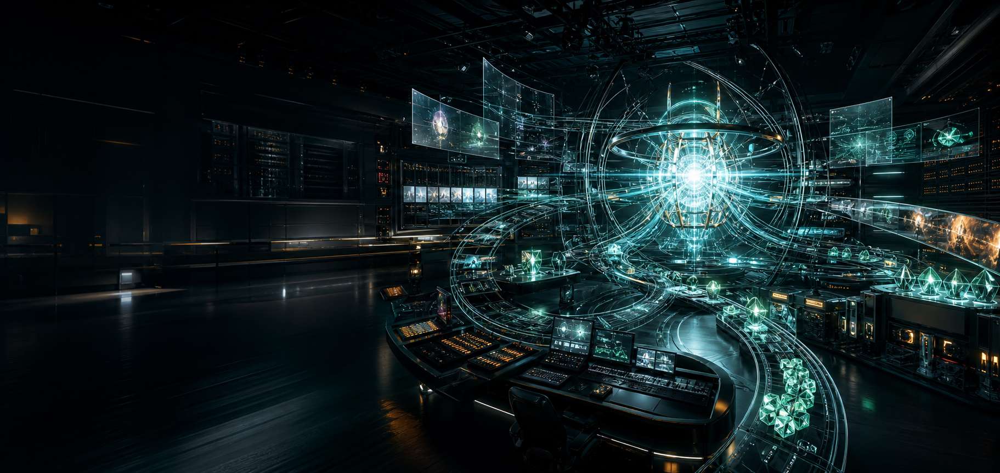
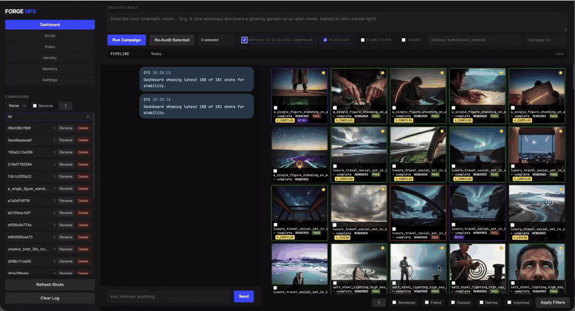
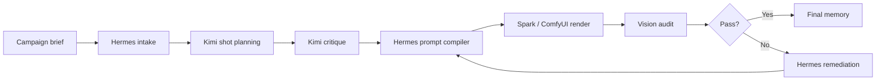
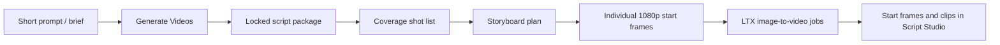
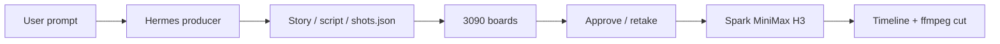

<p align="center">
  
</p>

<p align="center">
  
  <br>
  <a href="marketing/assets/the-cinesmith-demo.mp4"><strong>Watch full demo with sound</strong></a>
</p>

<h1 align="center">Cinesmith</h1>

<p align="center">
  <em>formerly Forge NPS</em> · <strong>A Hermes-led virtual agency for cinematic AI production — in real time.</strong>
</p>

<p align="center">
  You brief Hermes like an executive producer. Hermes plans, compiles, renders, audits, remediates, and remembers.
  Kimi Moonshot supports planning/critique. Spark executes images and video. This is an agency runtime — not a fixed “script runner.”
</p>

<p align="center">
  <a href="marketing/index.html"><strong>Marketing Site</strong></a>
  ·
  <a href="marketing/app-ui.html"><strong>App UI Concept</strong></a>
  ·
  <a href="docs/INSTALLATION_AGENT_GUIDE.md"><strong>Install Guide</strong></a>
  ·
  <a href="docs/CHANGELOG.md"><strong>Changelog</strong></a>
  ·
  <a href="docs/PIPELINE_CONTRACT_SUMMARY.md"><strong>Pipeline Contract</strong></a>
</p>

<p align="center">
  
  
  
  
</p>

---

## Desktop + Spark Quick Start

Mac/PC desktop + LAN Spark (ComfyUI) in about **15 minutes**. Full ship guide: **[docs/DESKTOP_SPARK_PACKAGE.md](docs/DESKTOP_SPARK_PACKAGE.md)**.

```bash
python3 -m venv .venv && source .venv/bin/activate
pip install -r requirements.txt
cp .env.template .env   # set COMFYUI_PRIMARY + optional Director key
python3 scripts/preflight_desktop_spark.py
./scripts/launch_cinesmith.sh --package
# open http://127.0.0.1:7000 → Settings → Test connections → Images / Stories / Videos
```

- **Isolation:** repo `hermes_home/` only (not `~/.hermes`).
- **Media:** sibling `CINESMITH_MEDIA` or `./media`.
- **Smoke:** `python3 scripts/smoke_cinesmith.py --base-url http://127.0.0.1:7000`

---

## The Operating Model

Cinesmith is built around one non-negotiable idea: AI production needs an agency brain, not a pile of disconnected prompts.

| Layer | Role |
| --- | --- |
| **Hermes Agent** | Pipeline brain for campaign intake, skill routing, prompt compilation, continuity, remediation, and memory writes. |
| **Kimi Moonshot** | Director planner and critique model, used for structured shot planning and self-check before render spend. |
| **Skill Pack** | A virtual agency library with 127 skill directories across protocols, Spark operations, style, lighting, diagnostics, continuity, product, character, and script work. |
| **Memory** | Persistent provenance for events, prompts, model choices, audit results, failures, retries, and final outcomes. |
| **Spark / ComfyUI** | Render execution: 3090s for stills, Spark MiniMax H3 for motion. |
| **Vision Audit** | Quality gate that drives remediation instead of silent failure. |

## Latest product surface

**Produce** at `/` is the product: prompt → Hermes story/script → 3090 storyboards → Spark MiniMax H3 takes → timeline → `cut.mp4`. Full guide: [docs/PRODUCE.md](docs/PRODUCE.md).

Also documented in [docs/CHANGELOG.md](docs/CHANGELOG.md):

- **Scout / Shoot** — H3 text-to-video, or boards then I2VA/FL2VA/R2VA
- **Queue** — GPU work waits if Spark/3090s are offline; Comfy presets take a prompt
- **Timeline** — reorder, mute, range retake, color pass, stereo kept
- **Legacy studio** (`/studio`) — Images / Videos / Stories / campaigns
- **Desktop + Spark package** — `launch_cinesmith.sh --package`, preflight, slim ship notes
- Storyboard rendering defaults to individual high-resolution production keyframes, not multi-panel page proofs. Page proofs remain an advanced diagnostic/export option.
- Storyboard image providers are configurable in Settings: local Spark/ComfyUI (`Flux2.Dev`, `Flux2 Klein`, `Z-Image`, `Z-Image Turbo`) plus optional OpenAI image generation and Gemini/Nano Banana when API keys are set.
- New local storyboard output filenames use the actual selected model prefix, such as `flux2_dev_...`, `flux2_klein_...`, or `z_image_...`, instead of the old compatibility adapter label.
- Main generation controls now use **Prompt** and **Generate Images** terminology.
- The prompt box is larger, blue-toned, and paired with a simplified toolbar.
- **Turbo** is in the same model pill as **Flux2.Dev** and only works when Flux2.Dev is enabled.
- **Anchor/Anchors** visible copy now reads **Character/Characters** while backend anchor fields remain compatible.
- The standalone **Models** tab, visible **Re-Audit Selected** controls, and world-bible path input were removed from the dashboard.
- The left navigation now starts with **Images**, then **Videos**, with **Characters** restored as its own tab and no persistent character thumbnail rail.
- The **Ideas** tab can use `/api/hermes/idea-board` or fall back to `/api/shots` on older running backends.
- The Images flow shows the inferred target count before launch and sends that count explicitly to Kimi, so requests like `20 images` plan twenty shots instead of falling back to five.
- The Videos tab uses wired quick options for model, duration, resolution, and aspect ratio, including a 25-second duration option. Retake and IC-LoRA are hidden until they have proper end-to-end controls.
- TikTok/vertical-short prompts now auto-activate a **TikTok Vertical** platform skill: 1080x1920, 9:16 framing, 8-15s pacing, hook-first guidance, caption-safe bottom third, and optional series continuity.
- The Ideas tab can generate/save TikTok hook cards with local audio-direction ideas, and the Video tab can export selected stills/clips as a ready carousel ZIP.
- `scripts/pre_push_hygiene.sh` checks tracked files for local runtime config, generated render dumps, obvious API tokens, and private/local IP addresses before pushing public changes.

## Why It Matters

<table>
  <tr>
    <td width="50%">
      
    </td>
    <td width="50%">
      <h3>Hermes is the agency brain</h3>
      <p>Hermes is not a decorative chat layer. It is the orchestration brain that moves a campaign from brief to plan, prompt, render, audit, retry, and memory.</p>
      <ul>
        <li>Campaign intake and runtime context</li>
        <li>Workflow-specific prompt compilation</li>
        <li>Continuity and remediation routing</li>
        <li>Provenance and memory writes</li>
      </ul>
    </td>
  </tr>
</table>

<table>
  <tr>
    <td width="50%">
      <h3>Memory makes it a true virtual agency</h3>
      <p>Cinesmith records what happened, why it happened, what failed, how it was corrected, and what finally passed. Production history becomes operational intelligence instead of lost context.</p>
      <ul>
        <li>Shot planning events</li>
        <li>Render attempts and results</li>
        <li>Audit scores and issues</li>
        <li>Retry lineage and remediation reasons</li>
      </ul>
    </td>
    <td width="50%">
      
    </td>
  </tr>
</table>

<table>
  <tr>
    <td width="50%">
      
    </td>
    <td width="50%">
      <h3>Kimi Moonshot plans and critiques</h3>
      <p>Kimi is used for director-level planning, not a single shallow prompt. It creates structured shot plans, rationale, constraints, coverage logic, and critique before Hermes executes.</p>
      <ul>
        <li>Structured shot list</li>
        <li>Coverage critique</li>
        <li>Constraint reasoning</li>
        <li>Production handoff to Hermes</li>
      </ul>
    </td>
  </tr>
</table>

## Skill Pack as Virtual Agency

Cinesmith extends Hermes with a curated, multi-layer skills library.

| Specialist Layer | Included Capability |
| --- | --- |
| **14 Cinesmith agent protocols** | Closed-loop Sense, Think, Act, Correct behavior. |
| **13 ComfyUI / Spark operating skills** | Renderer-facing production procedures. |
| **12 deep style specialists** | Cyberpunk, Ghibli, Wes Anderson, Caravaggio, Pixar, Ukiyo-e, Synthwave, Surrealism, Soviet Constructivist, Italian Giallo, Art Nouveau / Deco, Neural Aesthetic. |
| **10 diagnostic skills** | Failure-mode knowledge feeding audit and remediation. |
| **9 cinematography + 10 lighting skills** | Shot language, lensing, lighting, mood, and continuity. |
| **24 profile-specialist skills** | Character, product, and script expertise. |
| **25 bundled Hermes skill directories** | General-purpose upstream Hermes capabilities. |

Every shot record carries a `skills_used` list, so the pipeline tracks which knowledge fired on which render.

Full catalog: [docs/SKILLS_INDEX.md](docs/SKILLS_INDEX.md)

## Canonical Pipeline

Campaign image generation:



Script Studio video generation (legacy `/studio`):



Produce (home `/`):



## Canonical API Path

1. `POST /api/hermes/run-campaign`
2. `GET /api/shots`
3. `GET /api/hermes/idea-board`
4. `POST /api/script/pipeline/start`
5. `GET /api/script/pipeline/jobs/{job_id}`
6. `GET /api/script/storyboard/image-models`
7. `POST /api/script/storyboard/render-image`
8. `POST /api/script/storyboard/export-video-shots`
9. `POST /api/script/develop`
10. `POST /api/audit/reprocess`
11. `POST /api/audit/remediate`
12. `GET /api/memory/health`

Legacy dispatch and render routes are intentionally disabled and return `410 legacy_disabled`; see [docs/PIPELINE_CONTRACT_SUMMARY.md](docs/PIPELINE_CONTRACT_SUMMARY.md).

## Quick Start

```bash
cd /path/to/cinesmith_v01
python3 -m venv .venv
source .venv/bin/activate
python -m pip install -r requirements.txt
cp -n .env.template .env   # then edit keys/endpoints
bash scripts/launch_cinesmith.sh
```

`launch_cinesmith.sh` sets **Hermes isolation** (`HERMES_HOME=<repo>/hermes_home`, never `~/.hermes`) and a portable media root (sibling `CINESMITH_MEDIA` or `<repo>/media`).

Open:

```text
http://localhost:7000
```

First load opens **Produce**: type a video idea, pick Scout or Shoot, connect Spark / 3090s / an LLM. Legacy Images / Stories / Videos live at `/studio`. Press Connect in the header. Isolation: repo `hermes_home/` only.

Product vision: [docs/PRODUCT_VISION.md](docs/PRODUCT_VISION.md) · Produce: [docs/PRODUCE.md](docs/PRODUCE.md) · Roadmap: [docs/POLISH_ROADMAP.md](docs/POLISH_ROADMAP.md)

## Required Services

| Service | Default |
| --- | --- |
| Dashboard | `http://localhost:7000` |
| Kimi / NVIDIA-compatible API | `https://integrate.api.nvidia.com/v1/chat/completions` |
| LM Studio | `http://localhost:1234` |
| ComfyUI / Spark | `http://localhost:8188` |
| Media root | `CINESMITH_MEDIA_ROOT` or sibling `CINESMITH_MEDIA` or `<repo>/media` |

Minimum environment/config values:

```bash
KIMI_API_KEY=your_api_key_here
NIM_ENDPOINT=https://integrate.api.nvidia.com/v1/chat/completions
KIMI_INSTRUCT_MODEL=~moonshotai/kimi-latest
KIMI_THINKING_MODEL=~moonshotai/kimi-latest
USE_LOCAL_DIRECTOR=false

LMSTUDIO_HOST=http://localhost:1234
LMSTUDIO_PORT=1234
LMSTUDIO_CHAT_MODEL=qwen3.6-35b-a3b@q6_k
LMSTUDIO_VISION_MODEL=qwen3.6-35b-a3b@q6_k

COMFYUI_PRIMARY=http://localhost:8188
CINESMITH_MEDIA_ROOT=~/Desktop/CINESMITH_MEDIA

STORYBOARD_IMAGE_PROVIDER=spark:flux2_dev
OPENAI_IMAGE_MODEL=gpt-image-2
GEMINI_IMAGE_MODEL=gemini-2.5-flash-image
# OPENAI_API_KEY=optional_openai_key_for_storyboards
# GEMINI_API_KEY=optional_google_ai_studio_key_for_nano_banana_storyboards
```

`data/config.json` can override `.env` because the Settings page persists there. It is intentionally ignored by git. Use [data/config.example.json](data/config.example.json) as the tracked reference shape, and keep real local IPs/API keys only in `.env` or local `data/config.json`.

## Verification

```bash
python3 -m py_compile dashboard/cinesmith_dashboard.py core/hermes/pipeline/campaign_service.py core/hermes/pipeline/profile_cli.py
python3 -m pytest tests/test_profile_cli.py tests/test_director_shot_count.py
scripts/pre_push_hygiene.sh
curl -sS http://localhost:7000/api/stats
```

Run the full pre-demo checklist in [docs/STABILITY_CHECKLIST.md](docs/STABILITY_CHECKLIST.md).

## Active Documentation

| File | Purpose |
| --- | --- |
| [docs/INSTALLATION_AGENT_GUIDE.md](docs/INSTALLATION_AGENT_GUIDE.md) | Full setup/runbook for another agent or engineer. |
| [docs/ARCHITECTURE.md](docs/ARCHITECTURE.md) | Current runtime architecture, service boundaries, and data flow. |
| [docs/CHANGELOG.md](docs/CHANGELOG.md) | Dated implementation notes for the dashboard/profile tooling refresh. |
| [docs/PIPELINE_CONTRACT_SUMMARY.md](docs/PIPELINE_CONTRACT_SUMMARY.md) | Event, shot, memory, state, and fallback contract. |
| [docs/STABILITY_CHECKLIST.md](docs/STABILITY_CHECKLIST.md) | Pre-demo health and smoke checklist. |
| [docs/DEMO_SCRIPT.md](docs/DEMO_SCRIPT.md) | Demo script and judge-facing proof points. |
| [docs/SKILLS_INDEX.md](docs/SKILLS_INDEX.md) | Full categorized index of all 127 skills and profile-mounted skill sets. |
| [dashboard/COMMAND_CENTER_README.md](dashboard/COMMAND_CENTER_README.md) | Dashboard-specific API/UI reference. |
| [data/contracts/pipeline_contract.json](data/contracts/pipeline_contract.json) | Machine-readable pipeline contract. |

## Key Runtime Files

- [dashboard/cinesmith_dashboard.py](dashboard/cinesmith_dashboard.py)
- [core/hermes/pipeline/campaign_service.py](core/hermes/pipeline/campaign_service.py)
- [core/hermes/pipeline/director_service.py](core/hermes/pipeline/director_service.py)
- [core/hermes/pipeline/profile_cli.py](core/hermes/pipeline/profile_cli.py)
- [core/hermes/pipeline/audit_service.py](core/hermes/pipeline/audit_service.py)
- [core/prompts/prompt_compiler.py](core/prompts/prompt_compiler.py)

## Hermes Engine Submodule

`hermes_engine` is tracked as a submodule. To update it:

```bash
~/Desktop/cinesmith_v01/scripts/update_hermes_engine.sh
git status
git commit -am "chore: update hermes_engine"
git push
```

Keep Cinesmith-specific behavior in this repo (`dashboard/`, `core/`, `hermes_home/skills`, `hermes_home/profiles/cinesmith`) rather than editing upstream engine internals.

## README vs GitHub Pages

This README is GitHub-native Markdown and HTML. It can look like a polished landing page, but GitHub README rendering does not run custom CSS or JavaScript.

For the full animated website experience, publish [marketing/index.html](marketing/index.html) with GitHub Pages or another static host.
